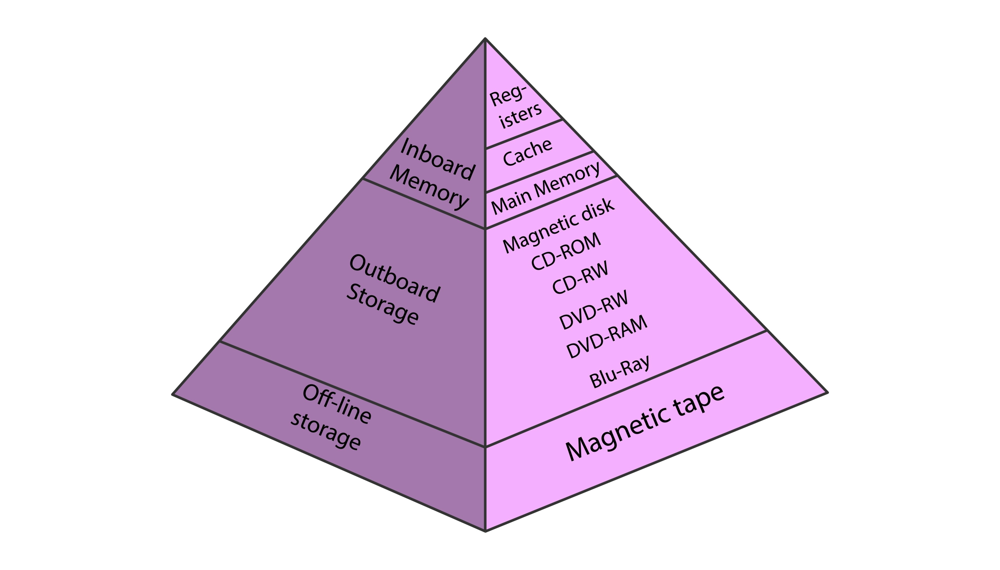

# The Foundation of Data Structures & Memory

## Table of Contents
1. [Introduction: Beyond Asymptotic Analysis](#introduction-beyond-asymptotic-analysis)
2. [Part 1: The Canonical Building Blocks - Organizing Data in Memory](#part-1-the-canonical-building-blocks---organizing-data-in-memory)
    - [Arrays: The Power of Contiguity](#arrays-the-power-of-contiguity)
    - [Linked Lists: The Flexibility of Pointers](#linked-lists-the-flexibility-of-pointers)
3. [Part 2: The "Why" - A Journey into the Machine](#part-2-the-why---a-journey-into-the-machine)
    - [Pointers and Memory Management](#pointers-and-memory-management)
    - [The Memory Hierarchy & The Principle of Locality](#the-memory-hierarchy--the-principle-of-locality)
    - [The Great Divide: Cache Performance](#the-great-divide-cache-performance)
4. [Part 3: Empirical Proof - Benchmark Analysis](#part-3-empirical-proof---benchmark-analysis)
    - [Benchmark 1: Sequential Traversal](#benchmark-1-sequential-traversal)
    - [Benchmark 2: Random Access](#benchmark-2-random-access)
    - [Benchmark 3: Insertion at Front](#benchmark-3-insertion-at-front)
5. [Part 4: Theory in Practice - Algorithmic Patterns](#part-4-theory-in-practice---algorithmic-patterns)
    - [The Time-Space Trade-off: Hash Maps](#the-time-space-trade-off-hash-maps)
    - [In-Place Manipulation: The Two-Pointer Technique](#in-place-manipulation-the-two-pointer-technique)
    - [Pointer Juggling: Mastering Linked List Operations](#pointer-juggling-mastering-linked-list-operations)
    - [Clever Algorithms: Detecting Cycles](#clever-algorithms-detecting-cycles)
    - [Advanced Patterns: Heaps for K-way Problems](#advanced-patterns-heaps-for-k-way-problems)
6. [Part 5: Conclusion and Further Study](#part-5-conclusion-and-further-study)
    - [Summary and Key Trade-offs](#summary-and-key-trade-offs)
    - [Recommended Resources & Further Reading](#recommended-resources--further-reading)
    - [Recommended Practice Problems](#recommended-practice-problems)
7. [Interview Prep & Knowledge Check](#interview-prep--knowledge-check)
    - [Mock Interview Spotlight](#mock-interview-spotlight)
    - [Foundational Q&A](#foundational-qa)
    - [Knowledge Check Quiz](#knowledge-check-quiz)
8. [Appendix: Benchmark C++ Source Code](#appendix-benchmark-c-source-code)

---

## Introduction: Beyond Asymptotic Analysis

The objective of this foundational lecture is to look beyond the conventional understanding of data structures, which often begins and ends with asymptotic analysis, commonly known as **Big O notation**. While Big O is an indispensable tool for evaluating the scalability of algorithms, it deliberately abstracts away the machine itself. This abstraction, while useful, creates a performance gap between theoretical complexity and real-world execution speed. A proficient software engineer understands that a `for` loop that is theoretically identical for two different data structures can have performance differences of orders of magnitude in practice.

This discrepancy is almost entirely explained by the physical realities of computer hardware, specifically the **memory hierarchy**. This lecture will bridge the gap between high-level code and the low-level machine operations - CPU cycles, cache hits, and RAM fetches - that ultimately determine performance. It is the understanding of this interplay between algorithm and architecture that separates a competent programmer from a high-performance engineer.

For example, both array traversal and linked list traversal are classified as $`O(n)`$ operations, suggesting their performance should be comparable for a given number of elements, $`n`$. However, empirical benchmarks consistently demonstrate that array traversal is dramatically faster. This reveals a critical limitation of relying solely on asymptotic analysis. Big O notation ignores constant factors, but when a "constant factor" driven by hardware interaction results in a 100x speed difference, it becomes the most important consideration for performance-critical code.

---

## Part 1: The Canonical Building Blocks - Organizing Data in Memory

### Arrays: The Power of Contiguity

#### Foundational Definition

An **array** is a data structure that stores a collection of elements, all of the same type, in a **contiguous block of memory**. This single characteristic - contiguity - is the fundamental source of an array's greatest strengths and its most significant weaknesses.

#### Static vs. Dynamic Arrays

The concept of an array can be divided into two primary categories based on how its size and memory are managed.
* **Static Arrays**: A static array has a size that is **fixed at compile time**. The memory for a static array is typically allocated on the **stack**, a region of memory known for its extremely fast access but limited size. This makes static arrays ideal for scenarios where the number of elements is known in advance and will not change.
* **Dynamic Arrays**: A dynamic array, by contrast, can change its size during run-time. Its memory is allocated from the **heap**, a much larger and more flexible pool of memory. In modern high-level languages, dynamic arrays are often the default implementation for list-like structures. Examples include Python's `list`, C++'s `std::vector`, and Java's `ArrayList`.

The mechanism that allows a dynamic array to grow is critical to understand. When the array's capacity is exceeded, the underlying system performs a resizing operation:
1.  A new, larger contiguous block of memory is allocated on the heap, often double the size of the previous block.
2.  All elements from the old memory block are copied to the new one.
3.  The old memory block is deallocated.

This resizing operation is computationally expensive ($`O(n)`$), but because it happens infrequently, the cost is spread out over many insertions. Through a process called **amortized analysis**, the average cost of an append operation is considered to be constant time, or **amortized $`O(1)`$**.

#### The Physics of $`O(1)`$ Indexed Access

The contiguity of arrays enables direct, constant-time access to any element via its index. The memory address of any element can be calculated with the formula:
$`element\_address = base\_address + (index \times size\_of\_one\_element)`$

This calculation involves only one multiplication and one addition, operations a CPU can execute in a single instruction. The time required is completely independent of the array's size, making it a true **$`O(1)`$** operation.

#### The $`O(n)`$ Cost of Mutation

While read access is fast, modifying the structure of an array can be slow. To insert or delete an element at the beginning or in the middle, the property of contiguity must be maintained. This requires shifting all subsequent elements, resulting in a linear time complexity of **$`O(n)`$** for these operations.

### Linked Lists: The Flexibility of Pointers

#### The Anatomy of a Node

A **linked list** is a linear data structure composed of a sequence of **nodes**. Unlike arrays, these nodes are not stored contiguously in memory; they can be scattered randomly across the heap. Each node contains two essential components:
* The **data** itself.
* A **pointer**, which is a variable that stores the memory address of the next node.

#### A Taxonomy of Linked Lists

* **Singly Linked List (SLL)**: Each node has one pointer (`next`). Traversal is forward only. It has the lowest memory overhead.
* **Doubly Linked List (DLL)**: Each node has two pointers (`next` and `prev`). Traversal is bidirectional. This makes deleting a known node an $`O(1)`$ operation, as its predecessor is instantly accessible.
* **Circular Linked List**: The `next` pointer of the final node points back to the head node, creating a loop. Useful for round-robin scheduling.

| Feature                 | Singly Linked List              | Doubly Linked List             |
| ----------------------- | ------------------------------- | ------------------------------ |
| **Memory Overhead** | Lowest (1 pointer)              | Higher (2 pointers)            |
| **Traversal** | Unidirectional (Forward)        | Bidirectional                  |
| **Deletion of known node** | $`O(n)`$ (must find predecessor)  | $`O(1)`$ (predecessor is known)    |

#### The Mechanics of $`O(1)`$ Insertion/Deletion

The primary advantage of a linked list is its ability to perform insertions and deletions in **constant time ($`O(1)`$)**, provided the location is known. To insert a new element at the head, only a few steps are required:
1.  Allocate memory for the new node.
2.  Set the `next` pointer of the new node to point to the current head.
3.  Update the list's head pointer to reference the new node.

This involves a small, fixed number of pointer reassignments, making it an $`O(1)`$ operation.

---

## Part 2: The "Why" - A Journey into the Machine

### Pointers and Memory Management

A **pointer** is a variable whose value is a memory address. In languages with manual memory management, this power comes with risks:
* **Dangling Pointers**: A pointer that references a memory location that has already been deallocated. Accessing it leads to undefined behavior or crashes.
* **Memory Leaks**: Occurs when a program allocates memory on the heap but loses all pointers to it, making it impossible to deallocate.

A concise way to distinguish them is: a dangling pointer is a valid pointer to invalid memory, whereas a memory leak is valid memory with no valid pointer. Modern C++ mitigates these issues with smart pointers (`std::unique_ptr`, `std::shared_ptr`).

### The Memory Hierarchy & The Principle of Locality



The computer memory hierarchy organizes storage systems into a pyramid of levels, balancing the trade-offs between speed, cost, and capacity. The guiding principle is to keep the most frequently accessed data in the fastest, most expensive layers, while storing less critical data in slower, cheaper, and larger layers.

#### The Levels of Memory
The hierarchy is typically divided into three main categories: inboard memory, outboard storage, and off-line storage.

##### Inboard Memory (Primary Storage) 🧠
This refers to all memory that the CPU can access directly without using I/O (input/output) channels. It is the fastest memory in the computer but also the most expensive and has the lowest capacity.

* **Components:** CPU Registers, Cache (L1, L2, L3), and Main Memory (RAM).
* **Special Characteristics:**
    * **Volatility:** Inboard memory is typically **volatile**, meaning its contents are lost when the computer loses power.
    * **Speed:** It offers extremely fast access times, measured in nanoseconds, allowing the CPU to work without significant delays.
    * **CPU Accessibility:** It is the *only* storage that the CPU can directly read from and write to. Data from slower storage must first be loaded into RAM to be processed.
    * **Addressability:** It is **byte-addressable**, meaning the CPU can access any individual byte of data.

##### Outboard Storage (Secondary Storage) 💾
This refers to storage that is not directly accessible by the CPU and is connected to the computer through I/O controllers. It serves as the main repository for data and programs that are not currently in active use.

* **Components:** Solid-State Drives (SSDs), Hard Disk Drives (HDDs).
* **Special Characteristics:**
    * **Non-Volatility:** Outboard storage is **non-volatile**, meaning it retains data even after the power is turned off. This makes it ideal for long-term storage of the operating system, applications, and user files.
    * **Speed:** It is significantly slower than inboard memory, with access times measured in microseconds (for SSDs) or milliseconds (for HDDs).
    * **Capacity:** It offers a much larger storage capacity at a lower cost per byte compared to inboard memory.
    * **Addressability:** It is **block-addressable**, meaning data is read and written in fixed-size blocks (e.g., 4 KB), not byte by byte.

##### Off-line Storage (Tertiary Storage) 🗄️
This is a type of storage that is not under the direct control of the CPU and often requires human or robotic intervention to be mounted and made accessible. It is used for archiving, backups, and transporting large amounts of data.

* **Components:** Magnetic tapes, optical disks (Blu-ray, DVD), and external hard drives or cloud storage services used for archiving.
* **Special Characteristics:**
    * **Removability:** Its defining feature is that the storage medium can be easily removed from the drive or system.
    * **Speed:** It has the slowest access times, which can range from seconds to minutes, as it may involve physically locating and loading a tape or disk.
    * **Capacity:** It offers vast storage capacity, making it suitable for backing up entire systems.
    * **Cost:** It has the lowest cost per byte of all storage types, making it economically feasible for storing enormous datasets.

---
##### Summary of Characteristics

| Characteristic      | Inboard Memory               | Outboard Storage         | Off-line Storage                |
| ------------------- | ---------------------------- | ------------------------ | ------------------------------- |
| **Access Speed** | Fastest (Nanoseconds)        | Medium (Micro/Milliseconds) | Slowest (Seconds to Minutes)    |
| **Volatility** | Volatile                     | Non-volatile             | Non-volatile                    |
| **Capacity** | Smallest (MB to GB)          | Large (GB to TB)         | Very Large (TB to Petabytes)    |
| **Cost per Byte** | Highest                      | Medium                   | Lowest                          |
| **CPU Accessibility** | Direct (Byte-addressable)    | Indirect (Block-addressable) | Indirect (Requires mounting)    |
| **Typical Use** | Running programs, active data | Storing files, OS        | Archiving, system backups       |

---
#### The Principle of Locality
When the CPU needs data not in its cache (a **cache miss**), it fetches a fixed-size block of contiguous memory - a **cache line** (typically 64 bytes) - from RAM. This system is effective because of the **principle of locality**: a tendency for programs to access the same or nearby memory locations repeatedly.
* **Temporal Locality**: If a program accesses a memory location, it will likely access it again soon.
* **Spatial Locality**: If a program accesses a memory location, it will likely access nearby locations soon.

### The Great Divide: Cache Performance

This is the single most important reason arrays often outperform linked lists in the real world.

#### Arrays and Spatial Locality (A Cascade of Cache Hits)

When iterating through an array, the access pattern is perfectly synergistic with CPU architecture.
* The first access (`array[0]`) causes a cache miss.
* The hardware fetches the entire cache line containing `array[0]`, which also loads `array[1]`, `array[2]`, etc., into the super-fast cache.
* Subsequent accesses (`array[1]`, `array[2]`,...) are now **cache hits**, which are orders of magnitude faster.
* The CPU's hardware **prefetcher** detects this sequential pattern and proactively fetches the next cache lines.
The result is an almost unbroken stream of cache hits, allowing the CPU to process data at maximum speed.

#### Linked Lists and Cache Misses (A Cascade of Pointer Chasing)

Traversing a linked list is hostile to the caching architecture.
* Accessing the first node causes a cache miss, and its cache line is loaded.
* To get to the next element, the program follows a pointer to a new memory address. Because nodes are scattered, this next node is almost certainly not in the current cache line.
* This results in another **cache miss**, forcing another slow round-trip to RAM.
This pattern repeats for nearly every node. Traversing a linked list can therefore devolve into a series of $`n`$ cache misses, with the CPU stalling on each step.

---

## Part 3: Empirical Proof - Benchmark Analysis

Theory is essential, but empirical data provides undeniable proof. The following benchmarks were performed in C++ using `std::vector` (a dynamic array) and `std::list` (a doubly-linked list) to demonstrate the real-world impact of memory layout.

### Benchmark 1: Sequential Traversal

This test iterates through every element of a container with 10 million integers and sums their values.
**Hypothesis**: The `std::vector` will be significantly faster due to its contiguous memory layout, which enables excellent cache performance. `std::list` will be much slower due to pointer chasing and frequent cache misses.

> **Typical Result:**
> * `std::vector` time: ~12.51 ms
> * `std::list` time: ~110.84 ms

**Analysis**: The vector is nearly **9 times faster**. This staggering difference for a theoretically identical $`O(n)`$ operation is a direct consequence of spatial locality. The vector's sequential memory access pattern keeps the CPU's cache full of relevant data, leading to a high cache hit rate. In contrast, the list's scattered nodes cause a cache miss for almost every element, forcing the CPU to constantly wait for data from slow main memory.

### Benchmark 2: Random Access

This test involves accessing 100,000 elements at random positions within the container.
**Hypothesis**: The `std::vector` will be orders of magnitude faster due to its $`O(1)`$ indexed access. The `std::list` will be exceptionally slow, as each access requires an $`O(n)`$ traversal from the beginning.

> **Typical Result:**
> * `std::vector` time: ~2.15 ms
> * `std::list` time: ~7854.21 ms

**Analysis**: The vector is over **3,600 times faster**. This result perfectly illustrates the algorithmic difference. The vector performs a simple address calculation for each access. The list, lacking direct access, must start from the head and traverse thousands of nodes for each of the 100,000 lookups, leading to a disastrously slow performance.

### Benchmark 3: Insertion at Front

This test measures the time taken to insert 100,000 new elements at the front of the container.
**Hypothesis**: The `std::list` will be dramatically faster due to its $`O(1)`$ insertion capability. The `std::vector` will be slow, as each insertion is an $`O(n)`$ operation requiring all existing elements to be shifted.

> **Typical Result:**
> * `std::vector` time: ~789.93 ms
> * `std::list` time: ~1.95 ms

**Analysis**: The list is over **400 times faster**. This benchmark highlights the linked list's primary strength. Each insertion is a simple pointer update, a constant-time operation. The vector, conversely, must shift its entire contents for every single insertion, resulting in quadratic overall complexity for the test and terrible performance.

---

## Part 4: Theory in Practice - Algorithmic Patterns

### The Time-Space Trade-off: Hash Maps

Problems like [*Two Sum*](https://leetcode.com/problems/two-sum/) (Easy) and [*Contains Duplicate*](https://leetcode.com/problems/contains-duplicate/) (Easy) highlight a classic trade-off.
* **Brute-force ($`O(n^2)`$ time, $`O(1)`$ space)**: Use nested loops. Simple, but slow.
* **Optimized ($`O(n)`$ time, $`O(n)`$ space)**: Use a hash map. Iterate through the array once, storing seen elements. For each element `x`, check if `target - x` (for Two Sum) or `x` itself (for Contains Duplicate) exists in the map. This trades extra memory for a huge gain in speed. This pattern also extends to problems like [*Contains Duplicate II*](https://leetcode.com/problems/contains-duplicate-ii/) (Easy).

### In-Place Manipulation: The Two-Pointer Technique

For problems like [*Remove Duplicates from Sorted Array*](https://leetcode.com/problems/remove-duplicates-from-sorted-array/) (Easy) and its more complex follow-up, [*Remove Duplicates from Sorted Array II*](https://leetcode.com/problems/remove-duplicates-from-sorted-array-ii/) (Medium), with an $`O(1)`$ space constraint, the **two-pointer technique** is ideal.
* A **slow-runner** (`write_index`) tracks the position for the next unique element.
* A **fast-runner** (`read_index`) iterates through the entire array.
If `nums[read_index]` is unique, it's copied to `nums[write_index]`, and both pointers advance. If it's a duplicate, only the `read_index` advances.

### Pointer Juggling: Mastering Linked List Operations

* **[*Reverse Linked List*](https://leetcode.com/problems/reverse-linked-list/) (Easy)**: The classic iterative solution requires three pointers: `previous`, `current`, and `next_temp`. In a loop, you reverse the `next` pointer of the `current` node to point to `previous` without losing the rest of the list. A harder variation is [*Reverse Linked List II*](https://leetcode.com/problems/reverse-linked-list-ii/) (Medium), which reverses a specific segment of the list.
* **[*Merge Two Sorted Lists*](https://leetcode.com/problems/merge-two-sorted-lists/) (Easy)**: Use a dummy head node to simplify edge cases. A `current` pointer builds the new list by comparing the nodes of the two input lists and appending the smaller one. This concept scales up to a common Hard problem, **[*Merge k Sorted Lists*](https://leetcode.com/problems/merge-k-sorted-lists/)**, which is optimally solved using a min-heap.

### Clever Algorithms: Detecting Cycles

The [*Linked List Cycle*](https://leetcode.com/problems/linked-list-cycle/) (Easy) problem has an optimal solution that requires insight beyond simple traversal.
* **Hash Set ($`O(n)`$ time, $`O(n)`$ space)**: Store visited nodes in a set. If a node is encountered twice, a cycle exists.
* **Floyd's Cycle-Finding Algorithm ($`O(n)`$ time, $`O(1)`$ space)**: The "Tortoise and the Hare". Use a slow pointer (moves 1 step) and a fast pointer (moves 2 steps). If there is a loop, the fast pointer is guaranteed to eventually lap the slow pointer. A common follow-up, [*Linked List Cycle II*](https://leetcode.com/problems/linked-list-cycle-ii/) (Medium), requires you to find the exact node where the cycle begins.

### Advanced Patterns: Heaps for K-way Problems
Problems involving multiple sorted lists often benefit from a **min-heap** (or priority queue) to efficiently track the smallest element across all lists. This is the key to solving problems like [*Merge k Sorted Lists*](https://leetcode.com/problems/merge-k-sorted-lists/) (Hard) and the even more advanced [*Smallest Range Covering Elements from k Lists*](https://leetcode.com/problems/smallest-range-covering-elements-from-k-lists/) (Hard).

---

## Part 5: Conclusion and Further Study

### Summary and Key Trade-offs

| Feature                       | Array (Dynamic, e.g., `std::vector`) | Linked List (Doubly)                |
| ----------------------------- | ------------------------------------ | ----------------------------------- |
| **Memory Layout** | ✅ Contiguous                        | ❌ Scattered                        |
| **Indexed Access** | ✅ $`O(1)`$                             | ❌ $`O(n)`$                             |
| **Insertion/Deletion (Middle)** | ❌ $`O(n)`$                             | ✅ $`O(1)`$ (if node is known)          |
| **Insertion/Deletion (End)** | ✅ $`O(1)`$ Amortized                  | ✅ $`O(1)`$                             |
| **Cache Performance** | ✅ Excellent                         | ❌ Poor                             |
| **Memory Overhead** | Low                                  | High (pointers)                     |
| **When to Use** | Default choice. Random access. Frequent iteration. | Frequent insertions/deletions at ends. Pointer stability is required. |

### Recommended Resources & Further Reading

#### Core Concepts & Textbooks
* ***Computer Systems: A Programmer’s Perspective (Bryant & O’Hallaron)***
    * **Sections 6.2 & 6.5**: Focus on locality and cache memory to understand *why* sequential data structures like arrays perform so well with cache.
    * **Section 3**: Explains the stack vs. heap and how data structures are laid out in memory.
* ***Memory Systems: Cache, DRAM, Disk (Jacob et al.)***
    * **Section 1**: Provides an overview of the memory hierarchy and its impact on performance, reinforcing the importance of cache locality in the array vs. list debate.
* ***Modern Operating Systems (Tanenbaum)***
    * **Section 1.5.1 (Processes > Address Space)**: Useful for understanding how memory is organized for processes.
* ***Introduction to Algorithms (CLRS)*** & ***The Algorithm Design Manual (Skiena)***: Essential texts for a deep dive into algorithms and data structures.

#### Online Resources & Visualizations
* **GeeksforGeeks Article**: *"Why Arrays have better cache locality than Linked Lists"* offers a simple, example-driven explanation of how sequential memory layout speeds up programs.
* **Visualizations**: USFCA Visualizations, DataStructures.live, and Y. Daniel Liang's Animations are excellent for visualizing how these structures work.

### Recommended Practice Problems
Here is a list of recommended LeetCode problems to solidify your understanding, categorized by difficulty.

#### Easy
- [*Two Sum*](https://leetcode.com/problems/two-sum/description/)
- [*Contains Duplicate*](https://leetcode.com/problems/contains-duplicate/description/)
- [*Contains Duplicate II*](https://leetcode.com/problems/contains-duplicate-ii/description/)
- [*Reverse Linked List*](https://leetcode.com/problems/reverse-linked-list/description/)
- [*Linked List Cycle*](https://leetcode.com/problems/linked-list-cycle/description/)
- [*Remove Duplicates from Sorted Array*](https://leetcode.com/problems/remove-duplicates-from-sorted-array/description/)
- [*Merge Two Sorted Lists*](https://leetcode.com/problems/merge-two-sorted-lists/)

#### Medium
- [*Linked List Cycle II*](https://leetcode.com/problems/linked-list-cycle-ii/description/)
- [*Remove Duplicates from Sorted Array II*](https://leetcode.com/problems/remove-duplicates-from-sorted-array-ii/description/)
- [*Reverse Linked List II*](https://leetcode.com/problems/reverse-linked-list-ii/description/)

#### Hard
- [*Merge k Sorted Lists*](https://leetcode.com/problems/merge-k-sorted-lists/description/)
- [*Smallest Range Covering Elements from k Lists*](https://leetcode.com/problems/smallest-range-covering-elements-from-k-lists/)

---

## Interview Prep & Knowledge Check

### Mock Interview Spotlight

> **Question**: "On modern hardware, why are arrays often faster than linked lists for traversal, even though both are $`O(n)`$?"
>
> **Answer Focus**: **Cache locality**. Explain that arrays have excellent spatial locality. When `array[0]` is fetched, the CPU cache also gets `array[1]`, `array[2]`, etc., leading to cache hits. Linked list nodes are scattered, causing a cache miss for almost every node. Use the "chef's countertop vs. pantry" analogy.

> **Question**: "When might a linked list be a better choice than an array (or `std::vector`)?"
>
> **Answer Focus**: Move beyond "fast insertions." Key use cases are: 1) **Pointer/iterator stability**: `std::vector` resizes invalidate pointers. 2) **True $`O(1)`$ queue/deque**: Implementing queues where insertions/deletions are strictly at the ends. 3) **Very large objects**: The cost of shifting large objects in an array can be prohibitive.

> **Question**: "Explain what a pointer is and the role it plays in memory access."
>
> **Answer Focus**: A pointer is a variable that stores a memory address. Instead of holding data directly, it holds the location *of* the data. To access the data, the system must "dereference" the pointer, meaning it looks up the address stored in the pointer to find the actual value in RAM. They are the fundamental mechanism behind linked lists and manual memory management on the heap.

> **Question**: "What problems can arise from incorrect pointer management?"
>
> **Answer Focus**: The two main issues are **dangling pointers** and **memory leaks**. Use the "opposites" analogy. A dangling pointer is a valid pointer to invalid (freed) memory, often causing a crash. A memory leak is valid (allocated) memory with no valid pointer to it, often causing a gradual slowdown and resource exhaustion.

### Foundational Q&A

**1. What is an array, and why is it called "contiguous"?**
An array is a data structure, like a bookshelf, where all its elements are stored side-by-side in one solid block of memory. It's called "contiguous" because there are no gaps between its elements; if the first element is at memory address 1000, the next one (for a 4-byte integer) will be at 1004, then 1008, and so on.

**2. What's the main difference between a static and a dynamic array?**
The main difference is when and how their size is determined.
* A **static array** has a fixed size that is set when the program is written (at compile-time) and cannot be changed. It's usually stored in a fast but limited memory area called the stack.
* A **dynamic array** (like `std::vector` in C++ or a `list` in Python) can change its size while the program is running. It's stored in a larger, more flexible memory area called the heap.

**3. How does a dynamic array (like a `std::vector` or Python `list`) "grow"? Is it slow?**
When a dynamic array runs out of space, it performs a resizing operation: it creates a new, larger array (usually twice the size), copies all the old elements into the new one, and then deletes the old one. This copying operation is slow by itself ($`O(n)`$ complexity). However, since this doesn't happen very often, the average cost of adding an element is considered very fast, or amortized $`O(1)`$.

**4. Why is accessing an array element by its index (e.g., `my_array[i]`) so fast?**
It's fast because the computer doesn't search for the element; it instantly calculates its exact address in memory. It uses a simple math formula: `element_address = starting_address_of_array + (index × size_of_one_element)`. This calculation takes a constant amount of time, regardless of the array's size, so its complexity is $`O(1)`$.

**5. What is a linked list, and how is it different from an array in memory?**
A linked list is like a treasure hunt. Its elements (called nodes) are scattered all over memory and are not stored side-by-side. Each node contains the data and a "pointer" (an address) that tells you where to find the next node in the chain.

**6. What is a "node" in a linked list?**
A node is the basic building block of a linked list. It consists of two parts:
* **Data**: The information we want to store (e.g., a number, a name).
* **Pointer(s)**: The memory address(es) that point to the next (and sometimes the previous) node in the list.

**7. What's the difference between a singly and a doubly linked list?**
* A **singly linked list** has only one pointer in each node, which points to the next element. You can only move forward through it.
* A **doubly linked list** has two pointers: one to the next element and another to the previous one. This allows you to move both forwards and backwards through the list, which makes some operations, like deleting the current node, more efficient.

**8. Why is adding a new element to the start of a linked list so fast?**
Because you don't have to shift anything. To add an element to the front, you just perform a few quick operations: create a new node, make it point to the old "head" of the list, and then declare this new node as the new "head." This takes constant time ($`O(1)`$), no matter how long the list is.

**9. Which is better: an array or a linked list?**
It depends on the task.
* An **array** is better when you need fast access to elements by index and you rarely insert or delete elements from the middle. Thanks to better cache performance, it's almost always faster for iterating through elements.
* A **linked list** is better when you need to frequently and quickly insert or delete elements from the beginning or end of the list (for example, to implement a queue).

**10. What is a pointer? Give a real-world analogy.**
A pointer is a variable that stores not the data itself, but the memory address where that data is located.
**Analogy**: A page number in a book's table of contents. The page number isn't the information, but it tells you where to find it. To get the information, you "dereference" the pointer - that is, you turn to the page number it points to.

**11. What's the difference between a 32-bit and a 64-bit computer?**
The main difference is how much memory (RAM) the computer can address.
* A **32-bit** computer uses 32 bits for memory addresses, allowing it to work with a maximum of $`2^{32}`$ bytes, or 4 GB of RAM.
* A **64-bit** computer uses 64 bits, allowing it to address $`2^{64}`$ bytes - a massive amount of memory (16 exabytes), far more than modern computers need. It also allows the processor to work with larger chunks of data at once.

**12. What is the size of a pointer (in bytes)?**
The size of a pointer depends on the computer's architecture. On a 32-bit system, a pointer takes up 32 bits (4 bytes). On a 64-bit system, it takes up 64 bits (8 bytes). This is logical, as a pointer needs to be large enough to store any possible memory address in the system.

**13. What's the difference between the stack and the heap?**
The stack and the heap are two main memory areas a program uses.
* **Stack**: A very fast, small memory area for static data, local variables, and function calls. Memory here is managed automatically (variables are created when a function is entered and deleted when it exits).
* **Heap**: A large memory area for dynamic data whose size isn't known at compile time (e.g., for dynamic arrays or linked list nodes). Memory on the heap must be allocated and freed manually (or by a garbage collector in some languages).

**14. What is a "memory leak" and why is it bad?**
A memory leak is a situation where a program allocates memory on the heap but then loses all pointers to it without freeing it. This memory becomes an "orphan" - it's occupied but inaccessible. This is bad because, over time, these leaks accumulate, reducing available memory, which can slow down or even crash the program or the entire system.

**15. What is a "dangling pointer" and how is it different from a memory leak?**
A dangling pointer is a pointer that continues to point to a memory location that has already been freed. Trying to use such a pointer leads to unpredictable behavior or a crash. They are opposites:
* **Memory Leak**: Valid memory that has no pointer to it.
* **Dangling Pointer**: A valid pointer that points to invalid memory.

**16. What is the "memory hierarchy" and why do we need it?**
It's a multi-level memory system in a computer, organized like a pyramid. At the top is the fastest but smallest memory (CPU registers, cache), and at the bottom is the slowest but largest (RAM, disks). It's needed to balance speed, cost, and size, since very fast memory is expensive. The hierarchy allows the most frequently used data to be kept in the fastest levels.

**17. What is the CPU Cache? Why is it so important for speed?**
The cache is a small, extremely fast memory buffer located very close to the CPU. It's important because accessing main memory (RAM) is very slow for modern CPUs. The cache stores copies of the most frequently used data, allowing the processor to get it almost instantly instead of waiting for slow RAM.

**18. What are L1, L2, and L3 caches?**
These are different levels of cache memory with varying speeds and sizes.
* **L1 Cache**: The smallest and fastest, built directly into each CPU core.
* **L2 Cache**: Larger but slightly slower than L1. Can be individual for each core or shared.
* **L3 Cache**: The largest and slowest of the three, usually shared by all CPU cores.

**19. What is a "cache line"?**
It's the smallest block of data (usually 64 bytes) that can be transferred between main memory and the cache. When the processor requests a single byte of data, it actually loads the entire 64-byte cache line containing that byte.

**20. What is a "cache hit" and a "cache miss"?**
* **Cache Hit**: The processor finds the data it needs in the cache. This is a very fast operation.
* **Cache Miss**: The processor does not find the data in the cache and is forced to go to the much slower main memory (RAM). This significantly slows down the operation.

**21. What are "spatial locality" and "temporal locality"?**
These are two types of predictable program behaviors that allow the cache to be effective.
* **Temporal Locality**: If a program accesses data, it's likely to access it again soon (e.g., a variable in a loop).
* **Spatial Locality**: If a program accesses data, it's likely to access data located nearby in memory soon after (e.g., the next element in an array).

**22. Why is iterating over an array almost always faster than iterating over a linked list?**
Because of spatial locality and the cache. Array elements are located sequentially in memory. When the processor loads one element, it automatically loads its neighbors into the cache (in the same cache line). Therefore, subsequent accesses become cache hits. Linked list nodes are scattered, so each access to the next node is likely to be a cache miss.

**23. What are "clock speed" and "CPU cycles"? How do they relate to speed?**
* **Clock Speed** (measured in Gigahertz, GHz) is the speed at which a processor performs basic operations. 3 GHz means 3 billion ticks (cycles) per second.
* A **CPU Cycle** is the smallest unit of time for a processor. Simple operations (like addition) might take one cycle, while complex ones (like accessing RAM) can take hundreds. The higher the frequency and the fewer cycles an operation takes, the faster the program runs.

**24. How are different data types, like integers and characters, represented in memory?**
Different data types take up different amounts of space. Typically:
* An integer (`int`) takes up 4 bytes.
* A character (`char`) takes up 1 byte.
* A floating-point number (`float`) takes up 4 bytes, while a `double` takes 8 bytes. Knowing this helps understand how data structures, especially arrays, are laid out in memory.

**25. My program uses addresses, but are they real physical addresses on the RAM chips? (Virtual vs. Physical Memory)**
No, they are usually virtual addresses. The operating system creates an illusion for each program that it has the entire address space to itself. A special hardware component in the CPU (the MMU - Memory Management Unit) translates these virtual addresses into real physical addresses in RAM. This allows the OS to manage memory efficiently, protect programs from each other, and use more memory than is physically available (using a swap file). This translation process adds a tiny delay, but the benefits far outweigh it.

**26. What is a hash table (or hash map)? How does it work?**
A hash table is a data structure that stores key-value pairs and provides very fast lookup, insertion, and deletion (average $`O(1)`$ ). It uses a hash function to convert a key (like a name) into an index in an internal array. The value is then stored at that index.

**27. What is a "hash collision" and how can it be solved?**
A collision occurs when a hash function generates the same index for two different keys. One of the most common solutions is **chaining**: instead of storing a single element at each array index, a linked list is stored. If a collision occurs, the new element is simply added to that linked list.

**28. What is the "two-pointer technique" used for?**
It's a common algorithmic pattern, especially for arrays, that uses two pointers (indices) to traverse or modify data in a single pass. For example, in the "Remove Duplicates from Sorted Array" problem, one pointer (`write_index`) tracks where to write the next unique element, while another (`read_index`) scans the entire array.

**29. How does the "Tortoise and the Hare" algorithm detect a cycle in a linked list without using extra memory?**
It uses two pointers: a "slow" one (the tortoise) that moves one step at a time, and a "fast" one (the hare) that moves two steps at a time.
* If there's no cycle, the fast pointer will simply reach the end of the list.
* If there is a cycle, both pointers will eventually enter it. Since the fast pointer is catching up to the slow one, it will inevitably "lap" it, and they will meet at the same node. This meeting is proof that a cycle exists.

**30. What does it mean when an operation has a complexity of $`O(1)`$, $`O(n)`$, or $`O(n^2)`$?**
It's a way to describe how an algorithm's execution time grows as the amount of input data (n) increases.
* **$`O(1)`$ (Constant Time)**: The execution time does not depend on the size of the data (e.g., accessing an array element by its index).
* **$`O(n)`$ (Linear Time)**: The execution time grows directly in proportion to the amount of data (e.g., iterating through all elements in a list).
* **$`O(n^2)`$ (Quadratic Time)**: The execution time grows in proportion to the square of the amount of data (e.g., nested loops that compare every element to every other element).

### Knowledge Check Quiz

**Question 1:**
An application processes a massive dataset of sensor readings, and the most common operation is to iterate through all readings sequentially from start to finish. Why would an array be significantly faster than a linked list for this specific task in a real-world scenario?
* A. The array's contiguous memory layout allows the CPU to load multiple adjacent elements into the cache at once, leading to a high number of cache hits.
* B. The array uses less memory overall because it does not need to store pointers for each element.
* C. The $`O(n)`$ complexity for array traversal has a smaller constant factor than the $`O(n)`$ complexity for linked list traversal.
* D. Accessing an element in an array using an index is an $`O(1)`$ operation, which makes the loop faster.

**Question 2:**
You are implementing a text editor's 'undo' feature. You need to frequently add and remove operations from the beginning of a sequence. Which data structure is theoretically and practically best suited for this, and why?
* A. A Linked List, because inserting or deleting at the head is an $`O(1)`$ operation that only requires updating a few pointers.
* B. An Array, because it provides $`O(1)`$ access to any element, which is useful for managing operations.
* C. A Linked List, because its elements are scattered in memory, which is more efficient for modern CPUs.
* D. An Array, because adding elements only requires a single memory allocation which is very fast.

**Question 3:**
What is the primary cause of a 'cache miss' when traversing a standard linked list?
* A. The next node in the sequence is likely in a completely different, non-contiguous memory location that is not in the current cache line.
* B. The CPU cannot calculate the memory address of the next node and must wait for the operating system.
* C. The data within each node is too large to fit into the CPU cache.
* D. Pointers take up too much space in the cache, leaving no room for the actual data.

**Question 4:**
A program stores a collection of objects in memory. Over time, the code loses every pointer and reference to a specific object. What is this situation called?
* A. A Memory Leak
* B. A Dangling Pointer
* C. A Segmentation Fault
* D. A Cache Miss

**Question 5:**
In Floyd's Cycle-Finding 'Tortoise and the Hare' algorithm, how is a cycle detected in a linked list?
* A. The fast pointer eventually laps the slow pointer, and they meet at the same node.
* B. The slow pointer reaches the end of the list (null) before the fast pointer.
* C. The fast pointer reverses direction and meets the slow pointer.
* D. The distance between the fast and slow pointers becomes a constant value.

#### Answer Key & Explanations
1.  **Correct Answer: A.** Rationale: This directly explains the performance gain by connecting the contiguous layout to the CPU cache mechanism and the principle of spatial locality. While B and C are true statements, they are not the *primary* reason for the dramatic speed difference.
2.  **Correct Answer: A.** Rationale: This correctly identifies the ideal data structure and links it to its fundamental $`O(1)`$ insertion/deletion capability at the beginning of the sequence.
3.  **Correct Answer: A.** Rationale: This correctly identifies that pointer-chasing between scattered nodes breaks spatial locality, forcing the CPU to fetch new, uncached memory blocks from RAM.
4.  **Correct Answer: A.** Rationale: This is the precise definition of a memory leak: allocated memory that has become unreachable and cannot be freed.
5.  **Correct Answer: A.** Rationale: This is the core principle of the algorithm. If a loop exists, the fast pointer will enter it and eventually catch up to and meet the slow pointer within the loop.

---

## Appendix: Benchmark C++ Source Code

```cpp
#include <iostream>
#include <vector>
#include <list>
#include <chrono>
#include <random>
#include <numeric>
#include <algorithm>
#include <iomanip>

// Use a volatile sink to prevent the compiler from optimizing away the loops
volatile long long sink = 0;

// High-precision timer using std::chrono
class Timer {
public:
    Timer() : start_time(std::chrono::high_resolution_clock::now()) {}
    double elapsed_ms() {
        auto end_time = std::chrono::high_resolution_clock::now();
        return std::chrono::duration<double, std::milli>(end_time - start_time).count();
    }
private:
    std::chrono::time_point<std::chrono::high_resolution_clock> start_time;
};

void benchmark_sequential_traversal(const std::vector<int>& vec, const std::list<int>& li) {
    std::cout << "\n--- Benchmark 1: Sequential Traversal ---\n";
    
    // Vector traversal
    Timer vec_timer;
    long long vec_sum = 0;
    for (int x : vec) {
        vec_sum += x;
    }
    sink = vec_sum; // Use the result
    double vec_duration = vec_timer.elapsed_ms();
    std::cout << "std::vector traversal time: " << std::fixed << std::setprecision(2) << vec_duration << " ms\n";

    // List traversal
    Timer list_timer;
    long long list_sum = 0;
    for (int x : li) {
        list_sum += x;
    }
    sink = list_sum; // Use the result
    double list_duration = list_timer.elapsed_ms();
    std::cout << "std::list traversal time:   " << std::fixed << std::setprecision(2) << list_duration << " ms\n";
}

void benchmark_random_access(const std::vector<int>& vec, const std::list<int>& li, const std::vector<size_t>& indices) {
    std::cout << "\n--- Benchmark 2: Random Access ---\n";

    // Vector random access
    Timer vec_timer;
    long long vec_sum = 0;
    for (size_t index : indices) {
        vec_sum += vec[index];
    }
    sink = vec_sum;
    double vec_duration = vec_timer.elapsed_ms();
    std::cout << "std::vector random access time: " << std::fixed << std::setprecision(2) << vec_duration << " ms\n";

    // List random access (simulated by advancing an iterator)
    Timer list_timer;
    long long list_sum = 0;
    for (size_t index : indices) {
        auto it = li.begin();
        std::advance(it, index);
        list_sum += *it;
    }
    sink = list_sum;
    double list_duration = list_timer.elapsed_ms();
    std::cout << "std::list random access time:   " << std::fixed << std::setprecision(2) << list_duration << " ms\n";
}

void benchmark_insertions_at_front() {
    std::cout << "\n--- Benchmark 3: Insertion at Front ---\n";
    const int INSERTION_COUNT = 100000;

    // Vector insertion at front
    Timer vec_timer;
    std::vector<int> vec_insert;
    for (int i = 0; i < INSERTION_COUNT; ++i) {
        vec_insert.insert(vec_insert.begin(), i);
    }
    double vec_duration = vec_timer.elapsed_ms();
    std::cout << "std::vector insertion time: " << std::fixed << std::setprecision(2) << vec_duration << " ms\n";

    // List insertion at front
    Timer list_timer;
    std::list<int> list_insert;
    for (int i = 0; i < INSERTION_COUNT; ++i) {
        list_insert.push_front(i);
    }
    double list_duration = list_timer.elapsed_ms();
    std::cout << "std::list insertion time:   " << std::fixed << std::setprecision(2) << list_duration << " ms\n";
}

int main() {
    const size_t ELEMENT_COUNT = 10000000;
    const size_t RANDOM_ACCESS_COUNT = 100000;

    std::cout << "Setting up benchmark data with " << ELEMENT_COUNT << " elements...\n";
    
    // Setup main data structures
    std::vector<int> main_vector(ELEMENT_COUNT);
    std::iota(main_vector.begin(), main_vector.end(), 0);
    std::list<int> main_list;
    main_list.assign(main_vector.begin(), main_vector.end());

    // Setup random indices for access test
    std::vector<size_t> random_indices(RANDOM_ACCESS_COUNT);
    std::mt19937 gen(1337); // Fixed seed for reproducible results
    std::uniform_int_distribution<size_t> distrib(0, ELEMENT_COUNT - 1);
    for (size_t i = 0; i < RANDOM_ACCESS_COUNT; ++i) {
        random_indices[i] = distrib(gen);
    }
    
    std::cout << "Setup complete. Running benchmarks...\n";
    
    benchmark_sequential_traversal(main_vector, main_list);
    benchmark_random_access(main_vector, main_list, random_indices);
    benchmark_insertions_at_front();

    return 0;
}
